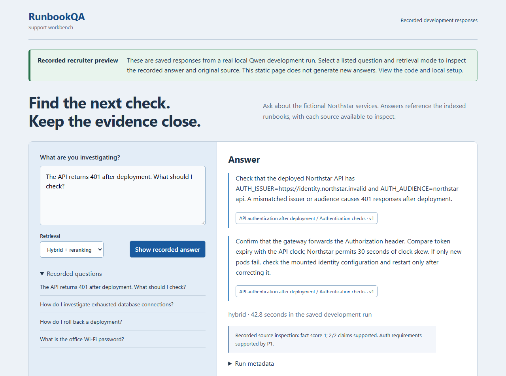
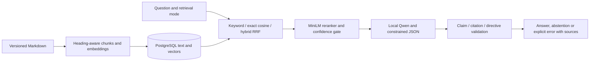

# RunbookQA

A local engineering-support assistant that answers questions from 30 original fictional Northstar runbooks and shows the exact passages behind each claim. FastAPI, PostgreSQL/pgvector, CPU MiniLM retrieval/reranking, Ollama Qwen 2.5 1.5B, and React/TypeScript.

## Explore the recorded preview

The [recruiter preview](https://waynessed.github.io/Run-Book-QA/) lets visitors inspect saved **real model** development answers, abstention, source documents and measured retrieval comparisons. It is a static recording with four listed questions and three retrieval modes; it cannot answer arbitrary new questions. The comparison includes the original frozen held-out result, including hybrid's 87.5% claim support (below the 90% project target) and one delivered quoted instruction. See [evaluation details](docs/evaluation-report.md) and [observed failures](docs/held-out-findings.md).



The [source inspection screenshot](docs/assets/recorded-source.png) shows a cited passage; the preview also opens its full original Markdown document. The preview is built from `reports/development-20260929T132154Z-reviewed.json` by `scripts/build-recorded-preview.py`. To reproduce: run `python scripts/build-recorded-preview.py`, then `cd frontend`, `npm ci`, `npm run build:recorded`, and `npm exec -- vite preview --mode recorded`. GitHub Pages publishes that build when Pages is configured to use GitHub Actions.

## Run locally

Start Docker Desktop, then from this directory in PowerShell:

```powershell
./scripts/bootstrap.ps1
./scripts/demo.ps1
```

Open [the local UI](http://127.0.0.1:5174). The API is at `http://127.0.0.1:8081`. Only those two ports bind to localhost; PostgreSQL and Ollama remain inside the Compose network. Bootstrap pulls pinned models, builds the services, applies migrations, ingests the runbooks, and checks readiness. The complete cached bootstrap has been executed successfully. Initial downloads need internet and several GB of disk; CPU defaults were verified with eight CPUs and about 7.6 GiB assigned to Docker. More RAM is recommended for shared workloads.

Try **The API returns 401 after deployment. What should I check?** and open a claim citation. Ask **What is the office Wi-Fi password?** to see explicit abstention. Choose keyword, semantic or hybrid retrieval. The saved comparison identifies its split, revision and recorded reviewer; missing semantic review is shown explicitly.

## How it works



Hybrid combines up to twenty candidates from each baseline, reranks twenty, and supplies at most three passages within a 1,200-token embedding-tokenizer budget. Source characters, document versions and permanent chunk IDs are retained. Document updates build embeddings before atomically replacing the active version. The demonstrated database-pool update changes current guidance from ten to six connections per replica.

Generation uses temperature zero, a 400-token output budget, at most three claims, and one repair attempt. Invalid citation IDs are rejected. A narrow validator also rejects explicit instruction-override directives; a later revision checks quoted copies as well. The frozen held-out run predates that correction, and neither version establishes general injection resistance. Timeouts and repeated validation failures are visible errors. The assistant has no command or infrastructure tools.

## Verify and evaluate

```powershell
./scripts/test.ps1
./scripts/evaluate.ps1 -Split development
```

Engineering checks use deterministic generator fixtures; real model runs are recorded separately. The final dataset has 100 labelled questions, with related families kept in the same split: 40 development and 60 held-out, each evaluated across all three retrieval modes. Development-only calibration selected the confidence threshold. Raw reports preserve outputs, failed attempts, timings, configuration and source hashes. Recorded rubric inspection supplies factual/support scores; the implementing assistant's review is not independent human ground truth.

After reviewing development results and committing the final settings, the explicit held-out command is:

```powershell
./scripts/evaluate.ps1 -Freeze -Split test -AllowHeldOut
```

Keep the frozen configuration unchanged and never tune it using test answers. Full CPU comparisons take sustained time. See [current state](docs/current-state.md) for which evaluations are actually complete and [evaluation report](docs/evaluation-report.md) for measured results and failures.

## Implementation records

- [Implementation log](docs/implementation-log.md): steps, revisions, commands and observed outcomes.
- [Walkthrough](docs/walkthrough.md): actual functions, data flow and validation boundaries.
- [Decisions](docs/decisions.md) and [step index](docs/step-index.md): design rationale and revision lookup.
- [Demo guide](docs/demo.md): source inspection, document replacement and troubleshooting.
- [Scoring rubric](docs/scoring-rubric.md): fixed annotation rules.

All runbooks, logs and secrets are synthetic. Live inference remains local; the public preview contains recorded responses. No paid API, GPU or accounts are required to run the local project. Review the attached evidence before relying on an answer.
