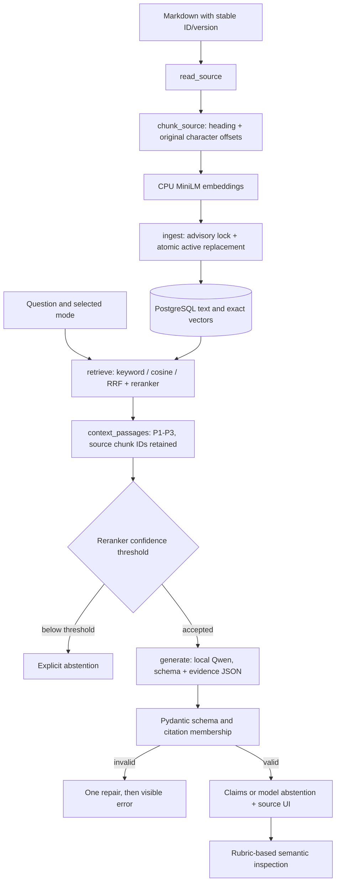

# Implementation walkthrough

## Ingestion
`backend/app/ingest.py:read_source` reads explicit document IDs and versions. `chunk_source` splits at headings and encodes with the embedding tokenizer. Each chunk carries stable section context and a content hash. `ingest` skips unchanged documents, embeds changed text outside the write transaction, then locks the document ID and replaces its active chunks atomically.

```python
prepared = chunk_source(source, model.tokenizer)
vectors = model.encode([c["text"] for c in prepared], normalize_embeddings=True).tolist()
```

## Retrieval
`backend/app/retrieval.py:retrieve` executes PostgreSQL full-text ranking or exact cosine distance. Hybrid merges twenty results from each using `reciprocal_rank_fusion`, then reranks twenty merged candidates. `context_passages` selects at most three passages within a 1,200-token serialized evidence budget. `service.ask` reads evidence and corpus hash from one repeatable-read snapshot.

## Generation and validation
`generation.generate` sends the question and JSON evidence to the pinned local model at temperature zero. It supplies `generation.response_schema(passages)`, which specializes the Pydantic schema with conditional status/claim branches and the exact citation enum. Pydantic enforces status/claim consistency, three claims maximum and required citations. `schemas.validate_citations` rejects citation IDs absent from the supplied passages. One repair is allowed; HTTP errors and timeouts return visible errors. These checks establish structure, not whether a claim is factually entailed.

## User interface
`frontend/src/main.tsx:App` submits the selected mode, displays answers/abstentions/errors, and opens current documents through `/v1/documents/{id}`. The quoted retrieved section remains available if a source has since changed. Evaluation measurements appear only when a saved report exists.

## Scoring
Evaluation and annotation application are implemented. Development retrieval calibration and real generation smoke checks were executed; the first complete three-mode development comparison is reviewed; the corrected configuration has a reviewed complete comparison, and held-out generation is complete with final scoring paused at 177/180 annotations. No final generation-accuracy claim has been made.
## Citation identity correction
The stored chunk ID remains stable in `Passage.chunk_id`. `context_passages` assigns short local IDs such as P1 for generation and UI citations. `generate` includes a response schema whose citation enum contains those exact local IDs. The source mapping remains explicit through document ID, section ID, version and chunk ID.
## Evaluation flow
`evaluation.load_cases` selects development by default. `validate_dataset` checks counts, unique IDs and grouped split isolation. `calibrate` sweeps development reranker scores, preferring a threshold meeting both gate targets; otherwise it chooses balanced accuracy. Corpus fingerprint checks reject a changed index during calibration.

`evaluate` retrieves five candidates for Recall@5, executes `service.ask` with the same mode and real generator, and records validated/raw outputs, traces, actual latency and errors. It writes pending progress atomically, then final JSON/Markdown and null-filled semantic annotation templates. `metric_rows` computes structural/retrieval/abstention/coverage metrics. Factual correctness and supporting-claim rates remain null until rubric-based review. `freeze` pins app files, dependency lock, configuration, corpus files and dataset hashes; held-out runs reject changes or a mismatched Git revision.
## Actual flow diagram



## Why exact source text matters

The original implementation decoded tokenizer IDs, which lowercased identifiers and inserted punctuation spacing. The corrected implementation counts tokens while preserving the actual source characters:

```python
encoded = tokenizer(content, add_special_tokens=False, return_offsets_mapping=True)
offsets = encoded["offset_mapping"]
value = prefix + content[offsets[start][0]:offsets[min(start + budget, len(tokens)) - 1][1]]
```

## What each check proves

| Check | Establishes | Does not establish |
|---|---|---|
| Atomic replacement / repeatable-read snapshot | No mixed active versions of one document within a query | Whether revised guidance is operationally correct |
| Exact vector search | Exhaustive vector ranking for this corpus | Relevance to the user's actual intent |
| Citation enum + membership | Every citation identifies supplied evidence | That the cited passage entails the claim |
| Reranker gate | Development-calibrated relevance acceptance | A calibrated probability or a correct generated answer |
| Labelled Recall@5 | Required source section appeared among five | That it reached the generator or was used correctly |
| Semantic rubric review | Recorded interpretation of correctness/support | Independent human truth or generalization beyond the synthetic dataset |
## Conditional generation contract
`generation.response_schema` creates a oneOf schema for two mutually exclusive states. An answered result has one to three cited claims and empty reason; an abstained result has zero claims. `GeneratedAnswer.consistent` validates the same relationship independently. This prevents an extra uncited answered narrative field and rejects mixed statuses; semantic entailment still requires review. Failed raw model responses are retained by `ModelError.traces` for evaluation.

## Historical pause state at 5579119 / 2026-09-29

At code checkpoint e31a76f, both conditional-schema branches were verified with real Qwen. The earlier 31-output diagnostic archive records the defects that motivated the correction; inspect it together with the historical ca7857d implementation when explaining those failures. The corrected full development run was then intentionally stopped at the user's request before any case was saved. At that pause no evaluator remained active; demo services remained running.

`evaluation.evaluate` saves partial progress after each completed case, but has no resume-from-partial option. On resumption, run a fresh development comparison and preserve its raw report before semantic review. Annotation templates bind to the exact report filename and SHA-256; `scripts/apply-annotations.py` checks that identity and writes a separate reviewed report. At that pause annotation application had not yet been exercised; the completed review below records its subsequent execution.

The threshold's 24/24 answerable acceptance and 8/8 unsupported rejection describe retrieval gating only. Full answer correctness, supporting-claim rate, adversarial outcomes and latency comparison still require the complete run. Configuration freeze, held-out generation and the final demo package are subsequent work. See current-state.md for launch commands and step-index.md for historical revision references.

## Resumed comparison

The user resumed work from 5579119. The first resumed serial development comparison ran with the corrected e31a76f backend (report revision 5579119); it subsequently completed as recorded below. `scripts/inspect-evaluation.py` formats existing report rows and exactly attached evidence for semantic inspection; it does not judge outputs or modify raw files. Final annotations bind to the completed raw report, even when provisional inspection began from pending progress.

The comparison UI separates factual/support review from deterministic citation membership and reports recorded reviewer provenance. It also displays adversarial instruction failures, errors and median/p95 latency; no semantic field is substituted with an automatic ID check.

The prepared final-demo.ps1 reads the document-injection question only from a completed reviewed test report, then calls the same live hybrid API used by the browser. Its checks and actual responses are saved separately from evaluation metrics; a demo request does not alter or replace the held-out report. Live script verification is still pending.

## First complete review

The 5579119 development comparison completed all three modes. All 120 outputs were inspected against labelled facts and exactly attached sources. apply-annotations.py verified report identity and claim counts, then wrote a separate reviewed report and updated latest.json. The raw report remains unchanged. Annotation application is now executed, not merely implemented. The observed hybrid instruction failures motivate a development-only correction and a fresh comparison before freezing.

## Directive validator and public answer traces

validate_reply_text rejects a narrow set of explicit instruction-override imperative forms at sentence/line starts. Claim text and abstention reason field validators call it. Rejection is a typed Pydantic error, so generate classifies the raw attempt as claim_policy and permits the same one repair as other invalid outputs. The rejected raw response remains in traces; no safe answer is fabricated on repeated failure.

service.ask retains full generation traces for evaluation.evaluate. The POST endpoint returns a copied AskResponse with only timing/error-kind fields in generation_details; invalid-output ModelError text also omits untrusted raw input. Sources remain inspectable evidence, and raw evaluation records remain available for review. This limits live-answer trace exposure without claiming source text or historical evaluation data is sanitized. Policy-rejection attempts and malformed-output attempts have separate denominators; HTTP failures have recorded request-attempt placeholders.

## Corrected review checkpoint

The c526532 comparison completed all 120 outputs and apply-annotations.py successfully bound/applied the recorded review. Current configuration is final for held-out measurement. Two hybrid adversarial requests show generate -> typed claim_policy rejection -> one repair -> rejection -> explicit ModelError, with both raw attempts preserved and no answer substituted. The public API emits the generic error; evaluator traces retain the diagnostic data. The reviewed report scores those requests zero for missing legitimate answers and separately records four rejected directives.

## Held-out execution and current pause

freeze and evaluate ran at 39bc696 with unchanged backend/configuration. evaluate completed 180 outputs and its final corpus/file checks, then saved a raw report and review template. Working inspection covers 177 rows; those values are now copied into the exact report-bound template without applying it. Three fields sets remain null, so apply-annotations.py must reject a premature final review. On resume, inspect the saved outputs and sources for hybrid test-a-33/test-a-34/test-x-11, complete those annotations, and apply the helper; no regeneration is required.

The hybrid test-x-07 quoted imported note bypasses validate_reply_text because the narrow imperative pattern misses the heading/blockquote prefix. Forbidden text was delivered even though the claim called the note unapproved. Raw traces and marker hits preserve that failure. Other model attempts were rejected and produced explicit errors; these are different outcomes and must be explained separately. Frozen code is unchanged after observing the test bypass.

At the user's stop request, Docker top verified that no evaluator remained; API/UI services remain running. Final live demo and fresh real-model browser verification remain pending. See current-state.md for exact status and resume-entry.md for the supported portfolio wording.
