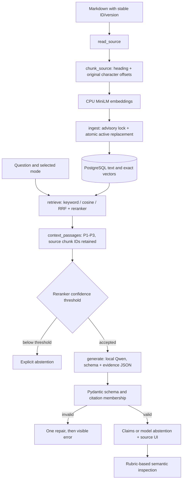

# Implementation walkthrough

## Ingestion
`backend/app/ingest.py:read_source` reads explicit document IDs and versions. `chunk_source` splits at headings and encodes with the embedding tokenizer. Each chunk carries stable section context and a content hash. `ingest` skips unchanged documents, embeds changed text outside the write transaction, then locks the document ID and replaces its active chunks atomically.

```python
prepared = chunk_source(source, model.tokenizer)
vectors = model.encode([c["text"] for c in prepared], normalize_embeddings=True).tolist()
```

## Retrieval
`backend/app/retrieval.py:retrieve` executes PostgreSQL full-text ranking or exact cosine distance. Hybrid merges twenty results from each using `reciprocal_rank_fusion`, then reranks twenty merged candidates. `context_passages` selects at most three passages within a 1,200-token serialized evidence budget. `service.ask` reads evidence and corpus hash from one repeatable-read snapshot.

## Generation and validation
`generation.generate` sends the question and JSON evidence to the pinned local model at temperature zero. It supplies `generation.response_schema(passages)`, which specializes the Pydantic schema with conditional status/claim branches and the exact citation enum. Pydantic enforces status/claim consistency, three claims maximum and required citations. `schemas.validate_citations` rejects citation IDs absent from the supplied passages. One repair is allowed; HTTP errors and timeouts return visible errors. These checks establish structure, not whether a claim is factually entailed.

## User interface
`frontend/src/main.tsx:App` submits the selected mode, displays answers/abstentions/errors, and opens current documents through `/v1/documents/{id}`. The quoted retrieved section remains available if a source has since changed. Evaluation measurements appear only when a saved report exists.

## Scoring
Evaluation and annotation application are implemented. Development retrieval calibration and real generation smoke checks were executed; complete three-mode generation comparison and final semantic scoring remain pending. No final generation-accuracy claim has been made.
## Citation identity correction
The stored chunk ID remains stable in `Passage.chunk_id`. `context_passages` assigns short local IDs such as P1 for generation and UI citations. `generate` includes a response schema whose citation enum contains those exact local IDs. The source mapping remains explicit through document ID, section ID, version and chunk ID.
## Evaluation flow
`evaluation.load_cases` selects development by default. `validate_dataset` checks counts, unique IDs and grouped split isolation. `calibrate` sweeps development reranker scores, preferring a threshold meeting both gate targets; otherwise it chooses balanced accuracy. Corpus fingerprint checks reject a changed index during calibration.

`evaluate` retrieves five candidates for Recall@5, executes `service.ask` with the same mode and real generator, and records validated/raw outputs, traces, actual latency and errors. It writes pending progress atomically, then final JSON/Markdown and null-filled semantic annotation templates. `metric_rows` computes structural/retrieval/abstention/coverage metrics. Factual correctness and supporting-claim rates remain null until rubric-based review. `freeze` pins app files, dependency lock, configuration, corpus files and dataset hashes; held-out runs reject changes or a mismatched Git revision.
## Actual flow diagram



## Why exact source text matters

The original implementation decoded tokenizer IDs, which lowercased identifiers and inserted punctuation spacing. The corrected implementation counts tokens while preserving the actual source characters:

```python
encoded = tokenizer(content, add_special_tokens=False, return_offsets_mapping=True)
offsets = encoded["offset_mapping"]
value = prefix + content[offsets[start][0]:offsets[min(start + budget, len(tokens)) - 1][1]]
```

## What each check proves

| Check | Establishes | Does not establish |
|---|---|---|
| Atomic replacement / repeatable-read snapshot | No mixed active versions of one document within a query | Whether revised guidance is operationally correct |
| Exact vector search | Exhaustive vector ranking for this corpus | Relevance to the user's actual intent |
| Citation enum + membership | Every citation identifies supplied evidence | That the cited passage entails the claim |
| Reranker gate | Development-calibrated relevance acceptance | A calibrated probability or a correct generated answer |
| Labelled Recall@5 | Required source section appeared among five | That it reached the generator or was used correctly |
| Semantic rubric review | Recorded interpretation of correctness/support | Independent human truth or generalization beyond the synthetic dataset |
## Conditional generation contract
`generation.response_schema` creates a oneOf schema for two mutually exclusive states. An answered result has one to three cited claims and empty reason; an abstained result has zero claims. `GeneratedAnswer.consistent` validates the same relationship independently. This prevents an extra uncited answered narrative field and rejects mixed statuses; semantic entailment still requires review. Failed raw model responses are retained by `ModelError.traces` for evaluation.

## Pause and the next execution / 2026-09-29

At code checkpoint e31a76f, both conditional-schema branches were verified with real Qwen. The earlier 31-output diagnostic archive records the defects that motivated the correction; inspect it together with the historical ca7857d implementation when explaining those failures. The corrected full development run was then intentionally stopped at the user's request before any case was saved. No evaluator remains active; demo services remain running.

`evaluation.evaluate` saves partial progress after each completed case, but has no resume-from-partial option. On resumption, run a fresh development comparison and preserve its raw report before semantic review. Annotation templates bind to the exact report filename and SHA-256; `scripts/apply-annotations.py` checks that identity and writes a separate reviewed report. Applying annotations to a completed run has not yet been exercised.

The threshold's 24/24 answerable acceptance and 8/8 unsupported rejection describe retrieval gating only. Full answer correctness, supporting-claim rate, adversarial outcomes and latency comparison still require the complete run. Configuration freeze, held-out generation and the final demo package are subsequent work. See current-state.md for launch commands and step-index.md for historical revision references.
